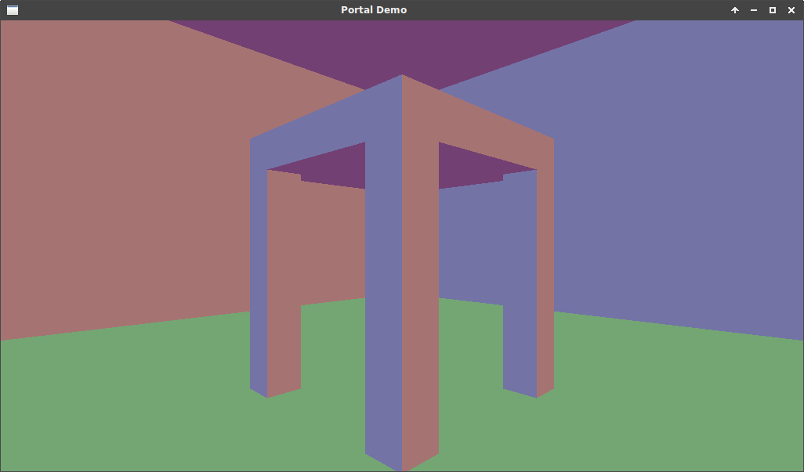
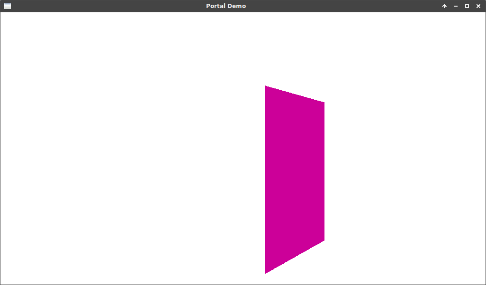
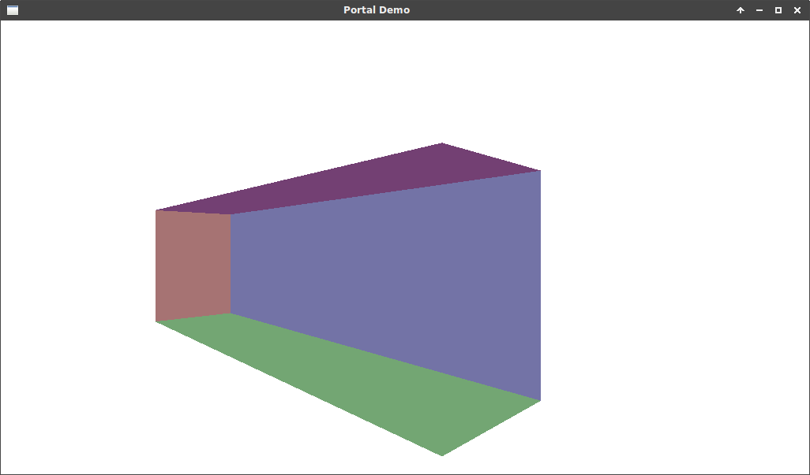
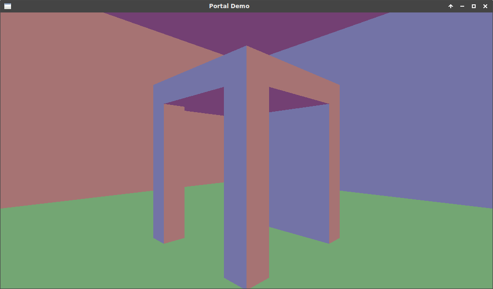

### Overview
This program allows for a portal effect, which is achieved by using the stencil buffer. This can be used interestingly to create impossible worlds.

The shaders are stored in `shaders/` folder, the object files are stored in `models/`, and images for this `README` are stored in `res/`. When the program is started `main` sets up the glut window, and initializes `Keyboard` and `Mouse` classes. These track the key and mouse input respectively. The `GameStateManager` is then initialized to track and run the current state. In the case of this program, the only state is `PlayState`. On `enter()` the play state loads the shaders `normal2.vs`, and `normal2.fs`, loads the level using `Level`, and initializes the player location from `Player`. The level loads the entities, and portals using `Entity`, `VAO`, and `Portal`. On `update()` the playstate checks mouse and keyboard input, checks portal and wall collision, and updates the player location. Finally, the render function displays the level data, with the portal effect. More detail on this can be found in the algorithm section.

Setting `bool lighting = true;` in `shaders/normal2.fs` will true on lighting. This works accurately to render the lighting, even through portals, but the lighting doesn't easily line up across the portal. Because of this it can become apparent where the border of the portal is. With `bool lighting = false;` the lighting will be turned off making the surfaces of the level to match.

### Algorithm
When trying to render the portals, if the portal exit view is rendered after the player view, it will simply overwrite it. To solve this, the portal exit view should only be rendered over top of the player view where the portal object is located. To accomplish this, the original scene from the player's position is rendered, without any portals. Next the colour and depth buffers are disabled, and the stencil buffer is enabled. This is done to render the portal object to the stencil buffer only. `glStencilFunc(GL_NEVER, 1, 0xFF)` is set so that the stencil test fails for every pixel drawn. `glStencilOp(GL_INCR, GL_KEEP, GL_KEEP)` is then used to increment pixels where the stencil test fails. Now that the stencil buffer has been set, it is disabled so that any new renders don't ruin it. The colour and depth masks are re-enabled so that any further rendering is displayed. The camera position is updated based on the delta between the portal entrance and exit. Using `glStencilFunc(GL_LEQUAL, 1, 0xFF)`, the portal exit view render is only displayed in any area of the stencil less than or equal to 1. This allows the view out the other side of the portal to be rendered only where the portal object is. This process is repeated for each portal that is in a position.

The scene is originally rendered from the player's perspective.


With the colour, and depth buffer disabled, the portal object is rendered to the stencil buffer.


The portal exit view is calculated, and rendered at every pixel that passes the stencil buffer test.


Once this is all put together:


Finally, a quick animated demo with lighting:


This algorithm can be expanded in the future by having the portals render recursively. Each successive portal will increase the number in the stencil buffer. This data can then be used to determine render order.

### Compilation
To compile run:
```
make clean; make; ./a.out
```
